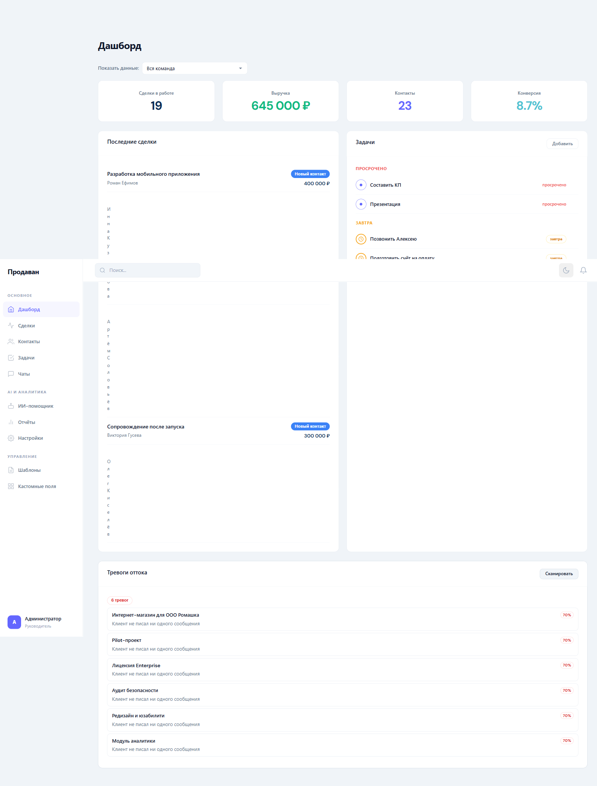
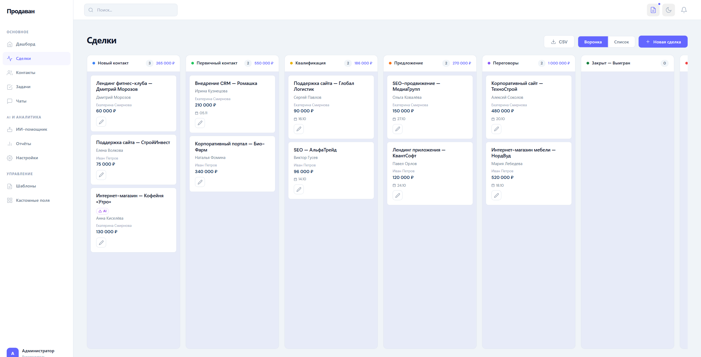
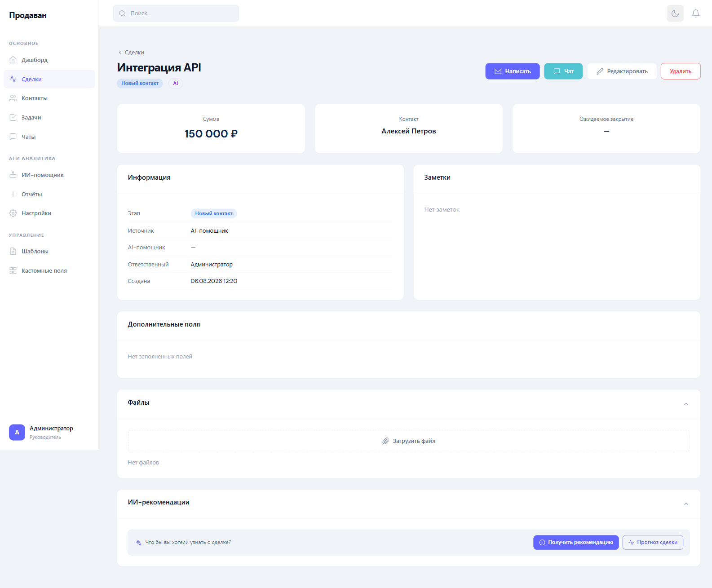
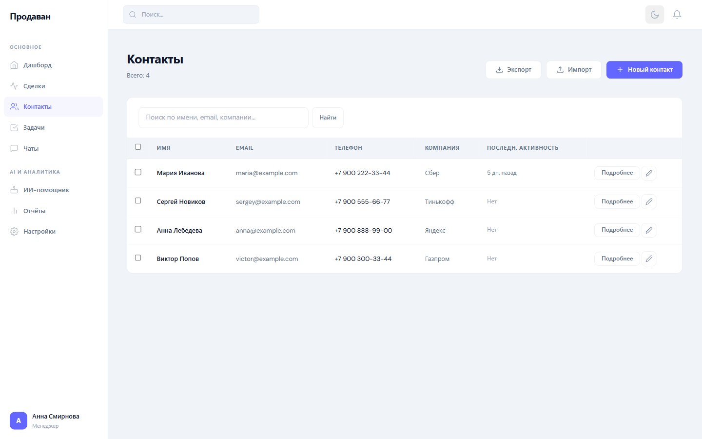
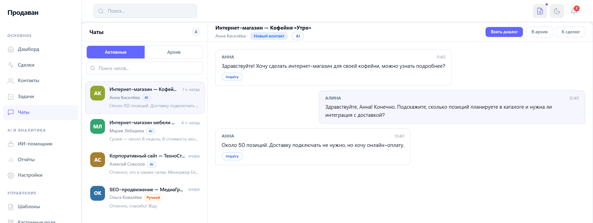
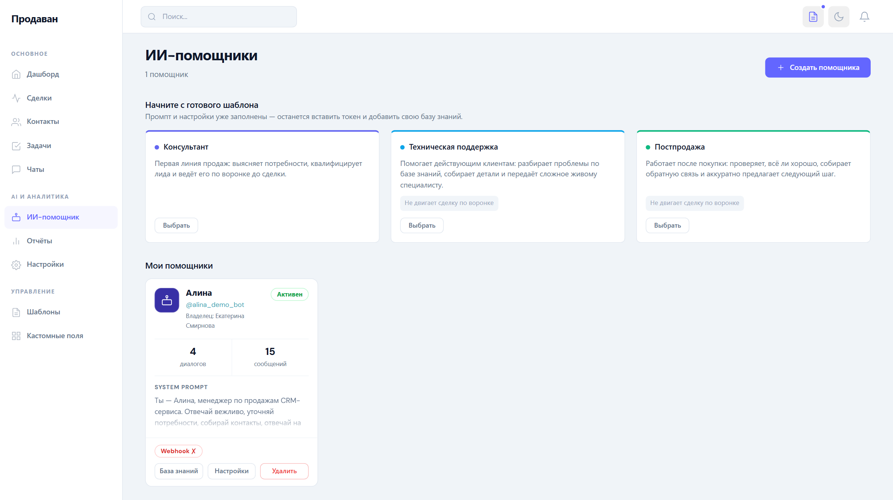
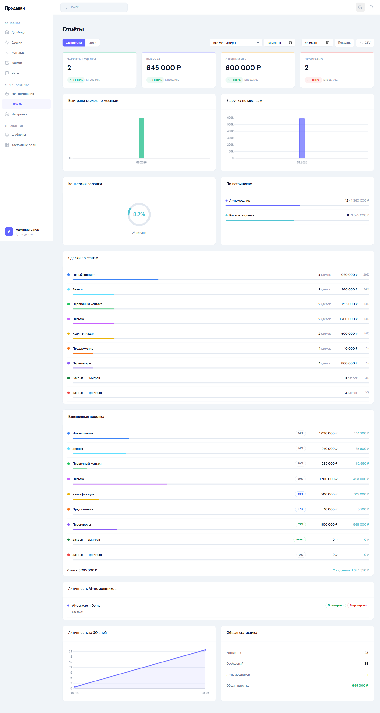
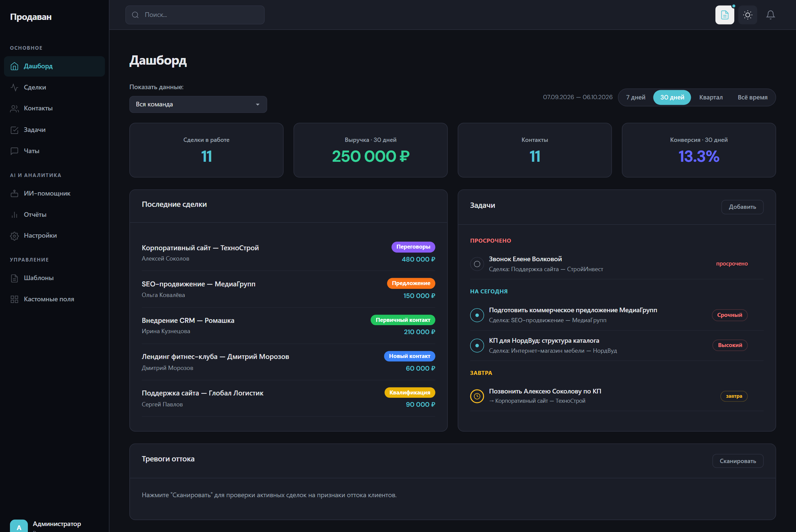
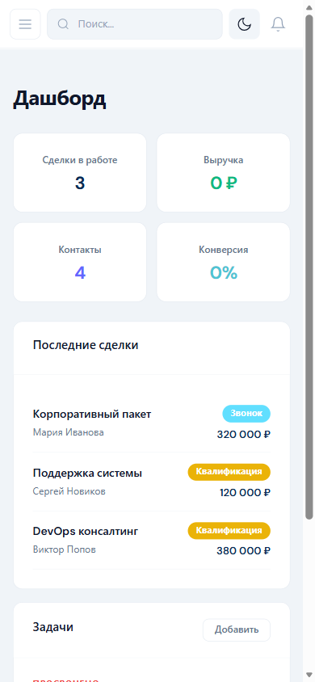

# Продаван — CRM с ИИ-помощниками для команд продаж

Сделки, контакты, задачи и переписка в одном окне, а рутину в диалогах берут на себя ИИ-помощники: отвечают клиенту в Telegram, готовят недельную сводку и подсвечивают сделки, где клиент начинает уходить.

> Это витрина проекта. Исходный код закрыт и в этом репозитории не публикуется.

---

## 1. Задача

Небольшие команды продаж держат данные о клиентах в таблицах, почте и мессенджерах одновременно:

- единой истории сделки нет — контекст теряется при переходе менеджера между задачами;
- воронка не управляется: не видно этапа, срока и суммы по каждой сделке;
- однотипные ответы клиентам съедают рабочее время;
- после сделки нет обратной связи — что клиент уходит, становится понятно только когда он уже ушёл.

Готовые CRM эту задачу решают, но платят за это сложностью: многоуровневые настройки корпоративных систем небольшой команде некуда применить, а освоение занимает недели.

## 2. Решение

Одна система, где менеджер видит свои сделки, контакты, задачи и переписку на одном экране, а часть коммуникации закрывают ИИ-помощники.

**Рабочий контур менеджера**

- **Дашборд** — сделки в работе, выручка, конверсия, онбординг для новичка по шагам.
- **Сделки** — канбан с этапами, перетаскивание карточек, файлы, лента активности.
- **Контакты** — единая картотека, импорт и экспорт CSV, кастомные поля под процесс команды.
- **Задачи** — приоритеты, дедлайны, группировка «просрочено / сегодня / завтра».
- **Чаты** — интерфейс мессенджера с перехватом диалога у бота, ручным режимом и редактированием сообщений.

**Слой ИИ — одиннадцать отдельных сервисов, а не одна «умная кнопка»**

| Сервис | Что делает |
|---|---|
| Автоответы | ведёт диалог с клиентом в Telegram по системному промпту и базе знаний |
| Автозаполнение | достаёт из переписки данные и подставляет в карточку сделки |
| Предсказание сделок | оценивает вероятность закрытия |
| Детект оттока | сканирует активные сделки и поднимает тревогу по признакам ухода клиента |
| Скрипты продаж | генерирует реплики под этап и контекст сделки |
| Недельная сводка | достижения, риски и план на неделю |
| Рекомендации | подсказки прямо в карточке сделки |
| Кэш запросов | снижает стоимость обращений к модели |

Помощник умеет сам предложить перевод сделки на следующий этап — именно той воронки, в которой сделка находится сейчас. Отдельная настройка «не двигать сделку по воронке» оставляет боту общение, но запрещает менять этап: нужна для техподдержки и постпродажи, где диалог не означает движения к сделке.

**Роли и видимость данных**

| Роль | Видит |
|---|---|
| Менеджер | только свои сделки, контакты, чаты, задачи, ботов и цели |
| Владелец команды | свои и участников команды, плюс настройки команды и почты |
| Админ | всё без фильтра, плюс воронки, кастомные поля и демо-режим |

Изоляция заложена в данные, а не в подписи кнопок: чужая запись недоступна и по прямой ссылке — открытие чужой сделки даёт редирект, а не чужие данные.

## 3. Аудитория

| Сегмент | Что им нужно |
|---|---|
| Менеджер по продажам | весь свой контур на одном экране, без переключения между вкладками |
| Руководитель небольшой команды | видеть работу команды, ставить цели и не настраивать систему неделями |
| Малый бизнес без отдела продаж | закрыть первичные обращения ботом, не нанимая отдельного человека |

## 4. Интерфейс

Дашборд: сводка по сделкам, выручке и задачам, онбординг для нового пользователя.

Воронка: канбан с этапами, суммами и перетаскиванием карточек.

Карточка сделки: история, файлы, задачи и лента активности в одном месте.

Контакты глазами менеджера — в списке только его записи. У админа тот же экран показывает все контакты команды.

Чат: ИИ ведёт переписку с клиентом, оператор может перехватить диалог в любой момент.

Настройка помощников: системный промпт, база знаний, привязка Telegram-бота.

Отчёты: воронка, каналы, конверсия, цели команды.

Тёмная тема — переключателем в шапке, на тех же компонентах.

Мобильная версия: сайдбар сворачивается в меню, таблицы и канбан перестраиваются.

## 5. Что реализовано

**Сделки.** Канбан и список, этапы с настраиваемыми воронками, статусы «выиграно» и «проиграно», файлы, лента активности по каждому изменению.

**Контакты.** Картотека с поиском, импорт и экспорт CSV, кастомные поля, профиль контакта со сделками и перепиской.

**Задачи.** Приоритеты, статусы, дедлайны, группировка по срокам, создание задачи ботом по намерению клиента.

**Чаты.** Диалоги, привязанные к сделке, перехват у бота, ручной режим, редактирование отправленного, архив.

**ИИ-помощники.** Создание бота с системным промптом и приветствием, три готовых шаблона — консультант, техподдержка, постпродажа, — своя база знаний, подключение Telegram-бота токеном от BotFather с проверкой токена при сохранении.

**Аналитика.** Отчёты по воронке и каналам, конверсия, взвешенная сумма по этапу, цели команды с прогрессом.

**Администрирование.** Команды и приглашения участников, роли, настройка воронок и этапов, кастомные поля, шаблоны сообщений, почта на уровне команды, демо-режим.

**Уведомления.** Колокольчик в шапке, уведомления о событиях по сделкам и задачам.

## 6. Техническая часть

| Слой | Решение |
|---|---|
| Бэкенд | PHP, собственный роутер, слой моделей и сервисов |
| База данных | MySQL, 24 таблицы, 11 миграций |
| Фронтенд | Bootstrap 5.3 и собственная дизайн-система на CSS-переменных |
| ИИ | OpenAI-совместимый API, кэширование запросов |
| Мессенджер | Telegram Bot API через вебхук |
| Почта | SMTP, настраивается на уровне команды |

Объём на момент подготовки кейса: **144 файла PHP**, около **24 000 строк** кода, **24 таблицы**, **11 сервисов слоя ИИ**.

Безопасность: защита форм токенами, экранирование вывода, ограничение частоты запросов, изоляция данных между пользователями и командами.

### Дизайн-система

Десятки экранов собраны из ограниченного набора компонентов: карточки, кнопки, бейджи, табы, формы, пустые состояния, всплывающие уведомления, карточки канбана.

Цвета заданы токенами, поэтому тёмная тема переключается без дублирования разметки — один набор переменных работает на обе темы.

| Токен | Значение | Роль |
|---|---|---|
| `--primary` | `#0B2B55` | глубокий синий, акцент текста |
| `--highlight` | `#6366FF` | индиго, действия и активные элементы |
| `--accent` | `#50C4D3` | бирюза, вторичные акценты |
| `--success` / `--warning` / `--danger` | `#10B981` / `#F59E0B` / `#EF4444` | успех, предупреждение, ошибка и отток |

Типографика: Unbounded для крупных заголовков и цифр, DM Sans для контента. В таблицах цифры набраны моноширинными — колонки не «дышат» при обновлении данных.

Форма: плоский минимализм, тонкие границы, тени только у всплывающих уведомлений, радиусы 6 / 8 / 12 / 16 пикселей.

## 7. Как проверялось качество

К проекту подготовлен документ требований для тестировщиков на **548 строк**: роли и видимость данных, навигация по разделам, все формы с обязательностью каждого поля и обоснованием ограничений, формулы расчётов — конверсия, взвешенная сумма по этапу, прогресс по цели, — сценарии прогона и формат отчёта о баге.

Проверки: регресс форм и ключевой логики, отдельный прогон по безопасности, замеры скорости ключевых страниц.

Честно про автотесты: автоматизированного покрытия у проекта почти нет — один скрипт проверки логики ИИ. Контроль качества держится на ручном регрессе по документу требований.

## 8. Ограничения

- Автотестов почти нет, регресс ручной — на большом объёме это узкое место.
- ИИ-помощники работают только через Telegram, веб-виджета на сайт нет.
- Лимит три помощника на пользователя.
- Почта настраивается на уровне команды, массовой рассылки по базе контактов нет.
- Телефония и запись звонков не подключены.
- Мобильная версия адаптивная, отдельного приложения нет.

## 9. Доступ к коду

Исходный код закрыт.

Связаться можно через **Issues** этого репозитория: https://github.com/Yaroslava-111/prodavan-case/issues

Другие мои работы: https://github.com/Yaroslava-111
